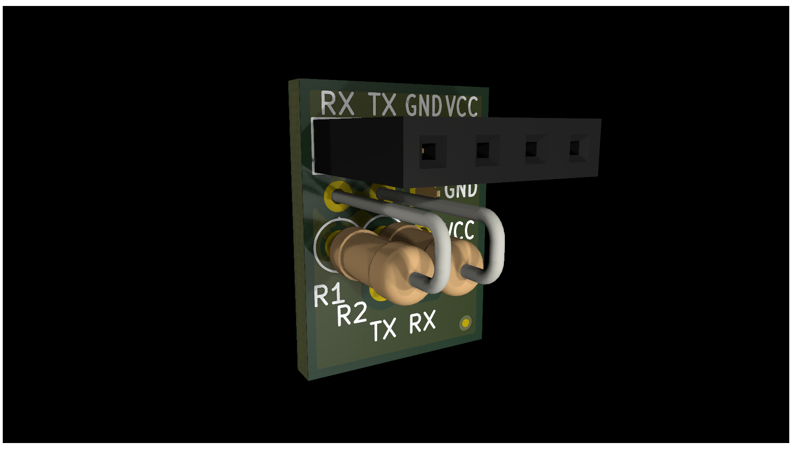

# HC-06 Module Adapter for Arduino Nano IO Shield

An open-source hardware adapter board to interface the HC-06 Bluetooth module to
the Arduino Nano via an I/O expansion shield.

## About

This was initially made to personally facilitate an logic circuits and design
class, where I condensed the adapter circuit for UART communication between the
HC-06 and the Nano. It is just a simple resistor divider to translate from the
Nano's TX to the HC-06's RX pin, as the HC-06 only operates on 3.3V logic level.

This is a very compact design, designed to be as minimally intrusive on the Nano IO shield as possible. This can also be implemented using a 4x4 perforated prototype board of pitch 2.54mm!

The bottom female pins are designed to slot onto the shield's three-row breakout pins, where the top row is ground, middle is 5V, and bottom rows are data/GPIO.

You may also program other GPIO pins to be the Nano's UART interface, apart from the dedicated ones at PD0 and PD1.

Note: The image shown below is an earlier design prototype.

## List of Materials

| Designator | Footprint / Value                  | Amount |
| ---------- | ---------------------------------- | ------ |
| J1, J2     | 01x02 pin socket with 2.54mm pitch | 2      |
| J3         | 01x04 pin socket with 2.54mm pitch | 1      |
| R1         | 1/4W 2K resistor                   | 1      |
| R2         | 1/4W 1K resistor                   | 1      |

## Assembly

Solder in order of smallest to biggest:

1. R1, R2
2. J1, J2
3. J3

### Notes

- J3 may be substituted with two 01x02 pin sockets with 2.54mm pitch.
- You may use a spare pin header to align the pin sockets correctly when assembling.

## License

This is licensed under the [TAPR Open Hardware License](http://www.tapr.org/OHL).

On the board, this is abbreviated as `TAPR OHL`

© Elizabeth Rosel 2025-2026
